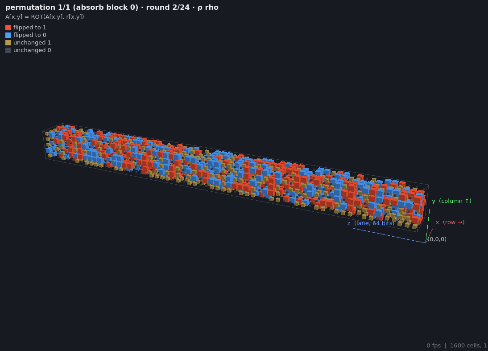

# keccakviz — an interactive 3D tour of Keccak-f[1600] and the SHA-3 sponge

A desktop application (Python, PyQt5, ModernGL) that shows the Keccak
permutation as a 5 × 5 × 64 cube of bits and lets you step through every
step mapping of every round, watch diffusion happen, and inspect the same
trace as slices, lane words, raw bytes, heatmaps, alternative bit layouts and
the sponge timeline.  One detail slider (Plain / Student / Expert) makes the
same tool useful for a layperson, a student and a hardware designer.

The core (`keccakviz.core`) is a GUI-free, fully traced reference
implementation of Keccak-p[1600] and the sponge, validated against the NIST
CAVP known-answer tests and `hashlib`.

```
pip install -e .            # or: pip install numpy PyQt5 moderngl
python -m keccakviz -m "abc"
pytest                      # KATs, structural tests, UI math
```



## Setup

Requirements: Python 3.9+, a GPU/driver with OpenGL 3.3 core profile (any
desktop GPU from the last decade; Mesa llvmpipe also works, slowly).

Linux (Debian/Ubuntu shown; other distributions are the same minus the
package names):

```
sudo apt install python3-venv libgl1 libxkbcommon-x11-0     # Qt needs these
python3 -m venv .venv && . .venv/bin/activate
pip install -e ".[test]"
python -m keccakviz
```

Windows (PowerShell):

```
py -3 -m venv .venv; .\.venv\Scripts\Activate.ps1
pip install -e ".[test]"
python -m keccakviz
```

Nothing in the code is platform specific; PyQt5, ModernGL and NumPy all ship
binary wheels for both platforms.  Development and all screenshots were done
on Linux (X11, Mesa/Intel); the Windows path has not been exercised by the
author, so please report anything that differs.  On Windows with an old Intel driver that
lacks OpenGL 3.3, set `QT_OPENGL=software` before starting (Qt's bundled
software rasterizer).

Useful command-line options (`python -m keccakviz --help`):

| option | meaning |
|---|---|
| `-m TEXT`, `--hex` | input message (text, or hex bytes) |
| `--variant SHA3-256` | SHA3-224/256/384/512, SHAKE128/256, Keccak-224/256/384/512 |
| `--rounds N` | reduced-round permutation |
| `--mode cube` | start in a view: cube, slices, lanes, bytes, heatmap, avalanche, interleaved, batched, sponge |
| `--snap K`, `--perm P` | start at snapshot K of permutation call P |
| `--preset`, `--color`, `--select x,y,z`, `--structure`, `--detail 0-2` | initial view state |
| `--anim-t 0.5` | freeze the current step's animation at t (for screenshots) |
| `--screenshot out.png`, `--screenshot-window out.png` | save the view / whole window and exit |
| `--json out.json` | export the whole sponge run (all traces) and exit; no GUI needed |
| `--bench SECONDS` | play the 3D animation, print the mean frame rate, exit |
| `--track`, `--dye`, `--pull`, `--word-bits`, `--words-per-cycle`, `--no-load`, `--style`, `--visibility`, `--spacing` | initial tracking / dye / pull-out / loading-bus / appearance state |

## Controls

| keys / mouse | action |
|---|---|
| → / . , ← / , | next / previous step mapping (θ, ρ, π, χ, ι) |
| ↑ / ] , ↓ / [ | next / previous round |
| Home / End | initial / final state of this permutation call |
| Space, P | play / pause (speed selector at the bottom right) |
| step scrubber (second slider) | drag to animate the current step by hand; drag into the right-hand zone to finish it and take the next step, into the left-hand zone to go back one step |
| N / B, "perm" buttons | next / previous permutation call (only exist for messages longer than the rate or SHAKE output longer than the rate); autoplay stops at the end of a call |
| F / Shift+F | track the selected bit, or the whole highlighted row/column/lane/slice/plane/sheet / clear all |
| D / Shift+D | dye the selected bit or highlighted structure / clear dyes |
| X / Shift+X | pull the highlighted structure out of the cube / push everything back |
| 1 … 9 | switch view mode |
| Esc | clear the cell selection |
| left-drag | orbit · right/middle-drag or shift-drag: pan · wheel: zoom |
| V / I / S / L / T | camera presets: perspective, isometric, slice-on, lane-on, top |
| Ctrl+1/2/3 | colour mode: raw 0/1, changed since previous step, avalanche difference |
| click a cell | show (x,y,z), lane index, bit index, value, ρ offset and the cells that feed it in the next step |
| hover / click the coloured chips | highlight a row, column, lane, slice, plane or sheet |
| Ctrl+S / Ctrl+E | save the current view as PNG / export the run as JSON |

The bottom bar also has a permutation-call selector (for multi-block
messages or long SHAKE output) and a scrubber over the 1 + 5·rounds
snapshots of the current call.

**Tracking bits.** Click a cell and press F (or use the *Tracked bits* dock).
The bit gets a coloured box that travels with it when ρ and π move it, a
trail of its past positions, and a label with its current value; the dock
lists, for every step, where it was, its value and what happened to it
(moved / flipped / unchanged).  With a substructure chip active (row, column,
lane, slice, plane, sheet), F tracks the whole structure through the selected
cell as one group: small groups (up to 8 bits) get boxes and trails, larger
ones tint their cells in the group colour so you can watch a whole sheet or
plane get scattered by ρ and π.  The dock summarises big groups per step (how
many moved, how many flipped).  Tracked bits are also shown in the slice
stack, lane table, byte view and the two grid views.  Up to eight groups.

**Step scrubber.** The second slider at the bottom animates the current
step by hand.  Its middle part scrubs t from 0 to 1; the grey bands near the
ends hold the initial / finished state so the result can be inspected; pushing
all the way into the coloured end zones hands over to the next step (right) or
the previous one (left), after which the handle stays put until the mouse is
released.  Playing and stepping with the keys drive the same clock, and the
slice stack animates in lock-step with the cube.  Autoplay stops at the end of
the current permutation call.

**Cells and spacing.** The *cells* selector picks how 0 and 1 are drawn (big
cube / small dark cube; equal orange and blue cubes; only the 1 bits; spheres;
white on black).  The *show* selector hides
the 0 bits or the 1 bits.  The *spacing* sliders extrude the lattice along x,
y or z so that slices, planes or sheets can be told apart.  During π, lanes whose
paths cross through other lanes fade into translucent light "ghosts" while
they overlap; π's lane moves are drawn as arrows on the front and back faces.

**Loading phase and words.** Each absorb call starts with a loading phase:
the padded block alone on the bus, then the state register as it was before
the absorb, then one frame per bus cycle as the bus delivers words that are
XORed into the rate.  *Word size* (1 … 64 bits) and *words per load cycle*
in the parameters set the bus width; the *Words* view shows the state as
words of that size with the arriving and the changed words highlighted.  On
the cube, *words as blocks* replaces the W cells of every word by one block
labelled with the word's hex value (coloured by the average of its cells, so
the changed / avalanche / dye colourings still apply); the slice stack tints
alternate words and outlines the selected cell's word instead, since a word
spans W slices there.  Untick *show the
loading phase* to start at the permutation input as before.

**Dyes.** Click a cell (optionally with a substructure chip active) and press
D, or use the *Dyes* dock to pick a colour first.  A dyed bit's colour is
mixed into every bit it feeds at each step (an output bit takes the average
of its sources: θ spreads to 11 cells, χ to 3, ρ and π carry).  The
dependency graphs are regular, so the total amount of each dye is conserved
and after enough rounds every cell holds the same mixture: the *unevenness*
readout (max / mean concentration) goes to 1.00.  Brightness shows a cell's
concentration relative to the strongest cell, hue the mix of dyes.

**Squeeze and more input.** Every permutation call whose output is read ends
with a *squeeze* frame: the output bits (the first d bits of the rate) fly out
onto the bus as green copies, 1 bright and 0 dark, the lanes read are boxed,
and the output hex is shown.  *+ input* (bottom bar, or the Sponge tab) absorbs
more data after the last permutation: the new input is padded on its own and
gets its own permutation, the duplex-style use of the sponge.  With extra
input the output is no longer SHA3 of the message, and the Parameters panel
says so; *remove* takes the extra inputs away again.

**Squeezing more.** *+ squeeze* (bottom bar) asks for more output, like the
streaming squeeze of an XOF: each call continues reading the rate where the
previous one stopped, and a permutation runs only when the rate is used up.
Each call gets its own read-out frame; bits read by earlier calls from the
same state are boxed faintly.  The output accumulates on a *tape* beside the
cube: every squeeze call is a strip of 64-bit rows placed next to the previous
ones and labelled with its number and size, so successive squeezes sit side by
side (the first 4096 output bits are shown).  The specification's limit is enforced: the
fixed-output functions (SHA3-*, Keccak-*) can be read in parts but never past
their digest length (the button disables itself once all of it is out), while
SHAKE128 / SHAKE256 have no limit.  *bytes per squeeze* in the parameters sets the
size, *reset* goes back to a single call.  The read-out is also shown as
words of the chosen word size (same bit order as the Words tab), in the HUD,
the Sponge tab and, with *words as blocks*, as labelled blocks on the bus.
The *rate / capacity* checkbox (cube toolbar and slice stack) outlines the
rate lanes in green and the capacity lanes in purple.

**Input / capacity blending.** In the Dyes dock, *dye input block (rate)* and
*dye capacity* (or *both*) dye the whole rate and the whole capacity at the
current call's permutation input.  The dock reports two measures: the
*mixture* (how unmixed the dye proportions still are, 100% = some cell holds
one dye only, 0% = every cell holds the same mix) with the frame where it
falls below 5%, and the exact *dependency* frame, the first frame at which
every one of the 1600 bits depends on every dyed bit.  For SHA3-256 the
mixture is within 5% after round 2's θ, and full dependency of every bit on
every input bit (and every capacity bit) is reached after round 3's χ.

**Pull-out.** With a substructure chip active and a cell selected, press X
(or the *pull out* button) to lift that region of positions out of the cube;
the animation continues with the lifted cells displaced, so θ and χ can be
watched acting inside a slice or row while ρ flies bits in and out of it.
Each lifted region has a diamond handle above it: drag it to move the region
anywhere in the screen plane.  Up to 16 regions can be out at once; they are
placed in columns of four and can then be dragged anywhere.  Shift+X pushes
everything back.  The *display* menu toggles the axes, HUD,
the operation/formula label above the cube, θ's sheets, the bus animation,
tracked-bit markers and trails, and word bands.

**Line detail.** The *lines* selector on the 3D view chooses how much is
drawn during animations: *none*, *focused* (feed lines and π arrows only for
the selected and tracked bits — the default), or *all* (every χ feed pair,
θ's parity beams, all π arrows).

## What each view is for

1. **3D cube** — the state as 1600 cells; bright = 1, small dark = 0.
   Axes are labelled with Keccak's vocabulary and the chips at the bottom
   highlight the six named substructures.  Each step mapping is animated:
   θ grows the C parity sheet and the D correction sheet under the cube and
   then flips whole columns; ρ slides every lane along z by its offset
   (cells leaving one end re-enter at the other); π moves lanes to their new
   (x, y) with arrows on the front and back faces; χ pulses the cells that
   flip and draws the two row neighbours that drive each; ι flips the round
   constant bits in lane (0,0).  "Changed" colour mode is the one to use to
   *watch* diffusion.
2. **Slice stack** — the 64 x-y slices unrolled, with its own controls: word
   grouping and word size, the rate/capacity shading, an x/y/z cell picker, the
   track / dye / clear buttons and the substructure chips.  θ and χ act inside a
   slice; ρ is the only step that moves bits between slices by more than one
   position.
3. **Lane table** — 25 lanes as 64-bit hex words in a 5 × 5 grid, with the
   XOR against the previous step, θ's C[x] and D[x], and ι's RC.  This is the
   format an implementer debugs against; "copy table as text" gives a dump.
4. **State bytes** — the 200-byte buffer with the rate/capacity boundary of
   the current variant drawn to scale, and the bytes an absorb just XORed in.
5. **Diffusion heatmap** — flip one chosen input bit; colour = round at which
   each of the 1600 bits first depended on it.  Full diffusion by round 3–4.
6. **Avalanche** — the XOR difference of the two runs at the current step and
   a Hamming-distance-vs-round plot that climbs to ≈ 800.  Untick θ in the
   parameters to see the plot collapse.
7. **Bit-interleaved** — every lane as an even-bit and an odd-bit 32-bit word
   side by side with the plain layout, and a worked example showing that
   ROL64 by r is two ROL32s (with a word swap when r is odd).
8. **Batched lanes** — N independent sponge instances with lane (x,y) of each
   packed into one vector register; θ's column parity becomes five
   element-wise XORs with no cross-element reduction.
9. **Sponge** — message input, the padding bytes (orange) appended to the
   data (green), rate/capacity split to scale, the absorb/squeeze timeline
   (click any permutation box to jump the 3D view there) and the
   permutation-call counter.

The **Parameters** dock changes everything live: variant, domain byte, rate
(any multiple of 8 from 8 to 200 bytes), rounds 1–24, output length, message
(text or hex), and the five step-mapping toggles.  The **Explanation** dock
tracks the current step and view at three levels of detail.

## Architecture

```
keccakviz/
  core/                GUI-free; importable without Qt or OpenGL
    keccak.py          Keccak-p[1600]: constants as data (RC from the LFSR, ρ offsets
                       from the (x,y)->(y,2x+3y) walk), θ/ρ/π/χ/ι on NumPy uint64 lanes
                       with an optional batch axis, full per-step Trace with θ's C and D,
                       sources_of()/targets_of() dependency relations
    sponge.py          pad10*1 + domain byte, absorb/squeeze, all variants, a SpongeRun
                       record of every block and permutation call
    analysis.py        avalanche (two parallel traces), single-bit diffusion
    layouts.py         bit-interleaving and batched-lane helpers
    export.py          JSON export of traces and runs
  ui/
    session.py         the one mutable model: parameters -> run -> position/selection
    anim.py            per-frame cell geometry for every step animation (pure NumPy)
    camera.py          orbit/pan/zoom camera, presets, picking rays
    glview.py          QOpenGLWidget + ModernGL: instanced cubes, lines, QPainter HUD
    transport.py       step/round/play controls
    params.py, explain.py, explain_text.py
    modes/             the 2D views (QPainter) and the sponge screen
    app.py             main window, menus, shortcuts, CLI
tests/                 NIST CAVP vectors (tests/kat), structural tests, UI math
```

State representation: a `(5, 5)` `uint64` array indexed `[x, y]`; bit `z` of
`A[x, y]` is `a[x][y][z]`.  Cell order in the UI is `320·x + 64·y + z`.  Byte
order follows FIPS 202: lane `(x, y)` occupies bytes `8·(x+5y)…`, little-endian.

The trace is computed once per parameter change (`Session.recompute`) — for
every permutation call of the sponge run — and every view is a pure function
of (run, position, selection).  Scrubbing never recomputes.

### Why ModernGL + PyQt5

- The requirement is 1600 animated cells at interactive rates.  With ModernGL
  the whole cube is **one instanced draw call**: a 36-vertex unit cube plus a
  per-instance buffer of (position, colour, scale).  Per frame the app
  uploads 1600 × 8 floats computed by NumPy.  Measured on an Intel HD 5500
  laptop GPU: building and packing a frame costs 0.5–1.8 ms (`anim.py`);
  the view renders at the 60 Hz vsync limit standing still and ~42 fps for
  the whole window while animating with the HUD on (`--bench 6`).
- Full control of the animations was the point: rho's wrap-around, pi's lane
  paths, theta's intermediate sheets are just arrays of positions, which a
  scene-graph library would have made awkward.
- PyVista/VTK would have worked (a single glyph mesh with updated points) but
  adds a 100 MB dependency and its own event loop conventions; VisPy's
  instanced meshes are newer and less documented.  Plotly was rejected without
  benchmarking: it is a browser widget, updates go through JSON per frame, and
  the brief asks for a desktop application.
- PyQt5 rather than PySide6/PyQt6: identical API for this purpose, most
  widely installed, and `QOpenGLWidget` integrates with ModernGL through
  `moderngl.create_context()` on the widget's current context plus
  `detect_framebuffer()`.  Text and HUD are drawn with `QPainter` on top of
  the GL frame (native painting is bracketed and GL state is reset before
  Qt draws, otherwise Qt's glyph quads are culled).

### Profiling notes

`python -m keccakviz --bench 6` plays the animation at the "fast" speed and
prints the mean frame rate.  Per-frame Python work (`anim.build_frame` +
buffer packing) is under 2 ms for every step; the remaining time is Qt's
overlay painting and the compositor.  Turn off "labels" to gain a few fps on
weak GPUs.  The permutation itself costs ~3 ms with tracing (24 rounds), so a
16 KB message (the input cap) traces in about 0.4 s.

## Correctness

- `tests/test_sponge.py` runs the NIST CAVP vectors vendored in `tests/kat`
  (all ShortMsg files; the first 12 vectors of each LongMsg file; every third
  SHAKE VariableOut vector — the full files are 1–2 MB each) and cross-checks
  SHA3-224/256/384/512 and SHAKE128/256 against `hashlib` for the empty
  message, one byte, one block − 1, one block, one block + 1, multi-block and
  1000-byte SHAKE output.  Original Keccak-256 is checked against its
  well-known digests.
- `tests/test_keccak.py` checks the round-constant LFSR against the table, the
  ρ offsets against the triangular-number walk, π as a permutation, χ as a row
  bijection, θ's C/D intermediates, trace consistency (each snapshot replays
  from the previous one), reduced rounds, step toggles, batch mode, and that
  `sources_of`/`targets_of` are mutually consistent and match real bit
  influence.
- `tests/test_ui_math.py` checks the animation endpoints against the static
  states, ρ/π motion, θ's sheets, the "changed" colouring, camera
  projection/ray consistency and session navigation — without a display.

## Design decisions and known simplifications

- **Reduced rounds** follow FIPS 202 Keccak-p: n rounds use RC[24−n … 23].
  The parameter panel has a toggle to use RC[0 … n−1] instead.
- **Disabled step mappings** still produce a snapshot (flagged *skipped*) so
  that trace indices stay uniform; the HUD says so.
- **Rate** is limited to multiples of 8 bytes in the UI (the core accepts any
  1–200); the domain byte must be < 0x80.
- **Message size** is capped at 16 KB in the UI (every permutation call is
  traced and kept in memory: 121 × 200 bytes plus overhead per call).
- **Diffusion heatmap / avalanche** are single-sample, data-dependent
  measures (χ passes a difference through an AND only when the neighbour bit
  is set); they are what an avalanche test measures, not the worst case.
- **Batched lanes** instance *i* hashes the message with `-i` appended and the
  batch is traced from the same permutation-call index as the current view
  (or the last call the shorter runs have).
- **Coordinates**: x to the right, y up, z into the screen with z = 0 nearest
  the default camera; the (0,0,0) corner is marked.  The ortho presets make
  aligned structures overlap exactly; the highlighted structure is pushed to
  the front by dimming everything else.
- The Expert-level gate counts are two-input-gate estimates for a full-width,
  one-round-per-cycle datapath; real numbers depend on the cell library.
- `--bench` and `--screenshot` exist so the visuals can be regression-checked
  from the command line (the screenshots in `docs/` were made that way).

## License

MIT.
